# Architecture and Data Flow

The repository separates user interaction, tabular preparation, model
orchestration, and tensor computation. The boundary keeps Streamlit concerns
out of inference code and allows the app pipeline to be tested without loading
the checkpoint.

```mermaid
flowchart LR
  A[CSV, Parquet, or demo] --> B[Upload parsing and limits]
  B --> C[Column mapping and time alignment]
  C --> D[Prepared target and covariate arrays]
  D --> E[Cached TimesFM3Evaluator]
  E --> F[TimesFM3Forecaster]
  F --> G[TimesFM3Torch]
  G --> H[ForecastOutput]
  H --> I[Tables, metrics, manifest]
  I --> J[Charts, comparison, ZIP]
```

## UI boundary

`streamlit_app.py` owns widgets, tabs, session state, model resource caching,
and presentation. It does not implement model transformations. Upload parsing
is session-scoped so decoded user data is not retained in a global Streamlit
cache.

## Explorer boundary

`timesfm3.explorer` owns application-domain policy:

- file parsing and memory limits
- timestamp sorting and future-axis generation
- target and covariate role validation
- forecast/holdout context construction
- the single `execute_forecast` pipeline
- result tables, metrics, lineage, and ZIP creation

The `BatchPredictor` protocol is the test seam. Tests substitute a deterministic
predictor and exercise the complete pipeline without model weights.

## Model boundary

`TimesFM3Forecaster` loads the checkpoint, validates numerical array shapes,
normalizes/interpolates inputs, calls the neural model, and returns structured
outputs. `TimesFM3Evaluator` layers benchmark defaults, independent-univariate
mode, and high-dimensional chunking on top.

`TimesFM3Torch` and its supporting modules own neural computation. They do not
know about files, Streamlit sessions, dataframes, or export formats.

## State and external systems

- Hugging Face supplies and caches the checkpoint.
- Streamlit session state retains decoded current uploads.
- DuckDB reads uploaded files and stores the newest 25 derived run artifacts.
- Git is queried with a two-second timeout to record the source revision.
- No queue or remote application store is configured.

## Failure flow

Input failures stop before inference and become actionable UI messages. CUDA
out-of-memory is handled separately. Unexpected checkpoint or model errors are
summarized at the UI boundary. Partial upload batches are not retained.

## Design trade-offs

- Temporary upload files are deleted immediately after DuckDB reads them;
  decoded data remains session-scoped.
- One cached model reduces reload latency but shares finite process/GPU memory.
- DuckDB retains 25 derived runs; ZIP export remains the portable record.
- Evaluator chunking supports more than 32 combined variates but can subsample
  covariates, so it requires explicit acknowledgement in the app.

For module-level evidence, see the detailed
[codebase architecture map](../codebase/ARCHITECTURE.md).
