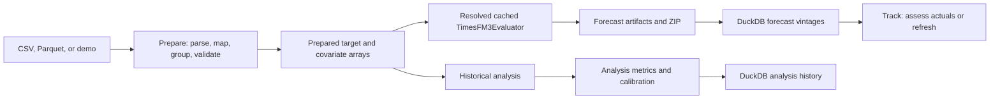

# Architecture and Data Flow

> [!NOTE]
> This page describes the retained Streamlit Explorer. The primary local
> interface is documented in the
> [React + FastAPI workbench architecture](workbench-architecture.md).

This page describes the retained Streamlit explorer. For the new default UI,
see [React + FastAPI workbench architecture](workbench-architecture.md).

The repository separates user interaction, tabular preparation, model
orchestration, and tensor computation. The boundary keeps Streamlit concerns
out of inference code and allows the app pipeline to be tested without loading
the checkpoint.

Open the [interactive Explorer architecture diagram](../diagrams/timesfm3-explorer-architecture.html)
to trace Forecast, Evaluate, and Track paths. Its editable
[source specification](../diagrams/timesfm3-explorer-architecture.json) describes
the current working-tree architecture.

## UI boundary

`streamlit_app.py` owns widgets, the Prepare/Forecast/Evaluate/Track workspaces,
session state, model resource caching,
and presentation. It does not implement model transformations. Upload parsing
is session-scoped so decoded user data is not retained in a global Streamlit
cache.

## Explorer boundary

`timesfm3.explorer` owns forecast-domain policy:

- file parsing and memory limits
- timestamp sorting and future-axis generation
- target and covariate role validation
- forecast/holdout context construction
- the single `execute_forecast` pipeline
- result tables, metrics, lineage, and ZIP creation

The `BatchPredictor` protocol is the test seam. Tests substitute a deterministic
predictor and exercise the complete pipeline without model weights.

Adjacent Explorer modules own separable workflows: `data_preparation` handles
long-format grouping, calendar generation, and quality previews; `analysis`
creates leak-free historical schedules and comparisons; `tracking` matches
issued forecasts to new actuals; `model_loading` resolves reproducible model
identity; `uncertainty` derives display bands and descriptive coverage; and
`run_store` persists derived local artifacts.

## Model boundary

`TimesFM3Forecaster` loads the checkpoint, validates numerical array shapes,
normalizes/interpolates inputs, calls the neural model, and returns structured
outputs. `TimesFM3Evaluator` layers benchmark defaults, independent-univariate
mode, and high-dimensional chunking on top.

`TimesFM3Torch` and its supporting modules own neural computation. They do not
know about files, Streamlit sessions, dataframes, or export formats.

## State and external systems

- Hugging Face supplies cached Hub checkpoints; compatible local checkpoints are
  also supported.
- Streamlit session state retains decoded current uploads.
- Temporary upload files are parsed with DuckDB and deleted immediately. The
  local DuckDB database stores only derived forecast, analysis, tracking, and
  assessment artifacts. It retains 25 untracked
  forecasts and 25 analyses; tracked forecast vintages are protected.
- Git is queried with a two-second timeout to record the source revision.
- No queue or remote application store is configured.

## Failure flow

Input failures stop before inference and become actionable UI messages. CUDA
out-of-memory is handled separately. Unexpected checkpoint or model errors are
summarized at the UI boundary. Partial upload batches are not retained.

## Design trade-offs

- Temporary upload files are deleted immediately after DuckDB reads them;
  decoded data remains session-scoped.
- One cached model reduces reload latency but shares finite process/GPU memory.
- DuckDB retains derived artifacts; ZIP export remains the portable record.
- Evaluator chunking supports more than 32 combined variates but can subsample
  covariates, so it requires explicit acknowledgement in the app.

For module-level evidence, see the detailed
[codebase architecture map](../codebase/ARCHITECTURE.md).
