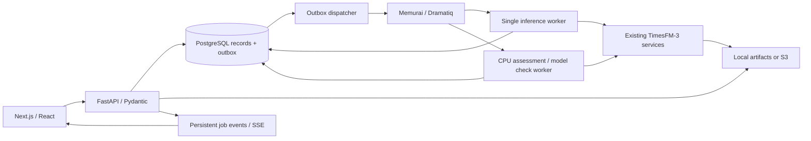
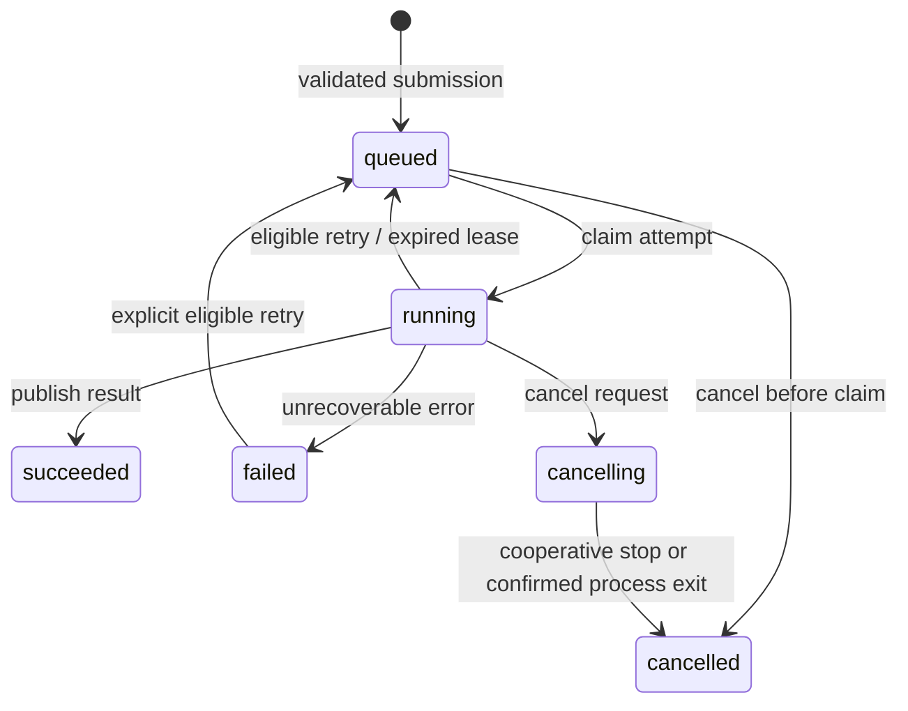

# React + FastAPI workbench architecture

The workbench reuses `timesfm3` preparation, forecasting, analysis, and tracking
functions. Transport, persistence, and process ownership live in `timesfm_app`.
No browser session owns inference or a saved result.

The Windows supervisor owns process identities and restarts failed children.
The inference worker performs preparation and model execution; the CPU queue
handles assessments and checkpoint checks. An exclusive process lock prevents
accidental duplicate inference consumers competing for GPU memory.

Open the [interactive architecture diagram](../diagrams/workbench-architecture.html)
to inspect components, relationships, and light or dark themes.

## Durable state

PostgreSQL stores workspace records, immutable dataset versions, revisioned
drafts, jobs, attempts, events, and immutable run manifests. Original uploads and
derived Parquet/ZIP artifacts live outside the database. The default store is
local; the S3 adapter implements the same artifact interface.

A submission atomically creates its job and outbox entry. Dispatch can repeat
after a crash, while a database claim permits only the current attempt to run.
Heartbeats renew leases. Result publication checks the attempt and cancellation
state in the same transaction. Frozen checkpoint metadata and immutable snapshots
keep retries tied to the resolved model.

React uses TanStack Query for server state and React Hook Form/Zod for editing.
URL selection and persistent drafts survive navigation. Revision conflicts expose
the newer draft rather than silently overwriting it. ECharts renders nested
intervals and comparisons; TanStack tables use server paging and virtualization.
Display-only history decimation preserves spikes without changing scored data.

## Boundaries

This is a local application with no authentication. Workspaces organize records;
they do not provide multi-user isolation. Services bind to loopback with origin
checks. Do not expose the service publicly as configured.

The legacy Streamlit explorer and DuckDB store remain intact. The new
`diagnostic_app.py` is an API-only client. The idempotent importer copies old
results and tracking metadata; it cannot reconstruct uploads never retained.

See [the native workbench guide](../how-to/native-workbench.md) for operations,
configuration, and monitoring. Older architecture documents describe the retained
Streamlit implementation.
