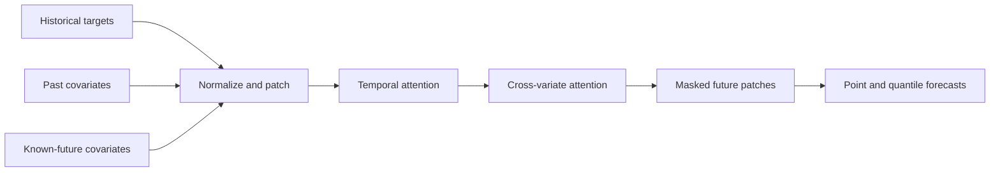

# Learn Google TimesFM-3

TimesFM-3 is Google Research's time-series foundation model for zero-shot
univariate and multivariate forecasting. This guide explains the model from
first principles and then shows how to use the PyTorch API in this repository.

**Audience:** Python users who understand arrays but are new to forecasting
foundation models.

> [!IMPORTANT]
> Repository code is Apache-2.0. The default TimesFM-3 pretrained weights use
> the separate TimesFM Non-Commercial License v1.0 and are restricted to
> non-commercial, non-production use.

## 1. What problem does TimesFM-3 solve?

A time series is an ordered sequence of measurements: daily sales, hourly
temperature, CPU utilization, website traffic, or electricity demand.
Forecasting estimates what comes after the observed sequence.

Traditional approaches often require a separate model, feature pipeline, and
tuning process for each dataset. TimesFM-3 instead provides a pretrained model
that can forecast previously unseen time series without task-specific training.
This is **zero-shot forecasting**.

TimesFM-3 supports three useful input patterns:

- **Univariate:** forecast one target from its own history.
- **Multivariate:** jointly forecast several related targets.
- **Covariate-aware:** include additional signals that may help explain future
  target behavior.

It returns a point forecast and, optionally, nine quantile forecasts that
describe uncertainty.

## 2. Core forecasting concepts

Before using the model, learn five terms.

### Context

The context is the historical window supplied to the model. If you provide the
last 512 daily sales values, the context length is 512.

More context can reveal long seasonal patterns, but it also consumes more
memory. This implementation keeps the most recent 15,360 context steps when
the supplied history is longer.

### Horizon

The horizon is the number of future steps to predict. A horizon of 24 means 24
future rows—not necessarily 24 hours. The timestamp frequency determines the
real-world duration.

### Target

A target is a series you want to forecast. A two-row context array means the
model jointly forecasts two targets.

### Covariate

A covariate is an additional series associated with the target.

- A **past-only covariate** is available over the historical context, such as
  measured weather.
- A **past-and-future covariate** is also known across the forecast horizon,
  such as a planned promotion or calendar event.

Covariates must be dynamic numerical arrays in the current TimesFM-3 API.

### Quantile

A quantile forecast describes a possible position in the predictive
distribution. For example, `q0.1` is a lower forecast and `q0.9` is an upper
forecast. The interval between them communicates uncertainty; it does not
guarantee that 80% of future observations will fall inside for every dataset.

## 3. How TimesFM-3 works

TimesFM-3 treats time-series segments as patches rather than processing one
scalar observation at a time.



The released configuration represented in this repository uses:

| Component | Value |
|---|---:|
| Input patch length | 32 steps |
| Output patch length | 64 steps |
| Transformer layers | 20 |
| Model dimension | 1,280 |
| Attention heads | 16 |
| Maximum variates per forward pass | 32 |
| Quantiles | 0.1 through 0.9 |

At a high level, the model combines two relationships:

1. **Temporal attention** learns how earlier patches relate to later patches.
2. **Variate attention** lets related targets and covariates exchange
   information at aligned time positions.

Every one of the 20 transformer layers performs temporal attention followed by
variate attention; the diagram condenses that repeated pattern into one stage.

Future target positions are masked. Known-future covariates provide information
for those positions without revealing the unknown targets. The model decodes
the requested forecast from this patched representation.

The original TimesFM paper explains the patched decoder lineage. The collected
project sources do not establish a separate TimesFM-3 technical paper, so avoid
attributing every TimesFM-3 mechanism to the original paper.

## 4. Understand the input shapes

TimesFM-3 uses NumPy arrays with time on the final axis.

### One target

```text
context.shape == (context_length,)
```

Example: 128 historical sales observations have shape `(128,)`.

### Multiple targets

```text
context.shape == (target_variates, context_length)
```

Example: sales and demand over 128 days have shape `(2, 128)`.

### Past-only covariates

```text
past_only_covariates.shape == (covariates, context_length)
```

The time length must match the target context.

### Past-and-future covariates

```text
past_future_covariates.shape == (
  covariates,
  context_length + horizon,
)
```

For a context of 128 steps and horizon of 24, the final dimension must be 152.
For either covariate type, one covariate may also be passed as a one-dimensional
array. The forecaster promotes it to a single-row, two-dimensional array.

For batch inference, provide a list of each array type. Companion lists and
time-series identifiers must contain exactly one entry per context. Context
lengths may differ across batch entries, but target counts and present
covariate counts must be consistent.

## 5. Install and load the checkpoint

From the repository root:

```powershell
uv sync --extra torch --group dev
```

Load the default checkpoint on CPU:

```python
from timesfm3 import TimesFM3Forecaster

model = TimesFM3Forecaster.from_pretrained(
  "google/timesfm-3.0-pytorch",
  device="cpu",
)
```

The first call downloads model configuration and weights from Hugging Face.
Later calls reuse the cache. Use `device="cuda"` when PyTorch can access a
compatible NVIDIA GPU.

To work from an existing cache without network access:

```python
model = TimesFM3Forecaster.from_pretrained(
  "google/timesfm-3.0-pytorch",
  device="cpu",
  local_files_only=True,
)
```

You can also provide a local checkpoint directory or a `.safetensors`, `.pth`,
or `.pt` file. Load only trusted checkpoint files.

## 6. Run a univariate forecast

Create a file named `forecast_example.py` in the repository root, then add this
example to forecast the next 24 steps:

```python
import numpy as np

from timesfm3 import TimesFM3Forecaster

model = TimesFM3Forecaster.from_pretrained(device="cpu")

time = np.linspace(0, 20, 256)
context = (
  np.sin(time) + 0.05 * np.random.default_rng(7).normal(size=time.size)
).astype(np.float32)

output = model.predict(
  context=context,
  horizon=24,
  return_quantiles=True,
  sort_quantiles=True,
)

assert output.forecast is not None
assert output.forecast.shape == (24,)
assert output.quantiles is not None
assert output.quantiles.shape == (24, 9)

print(output.forecast)
```

Run it from the repository root:

```powershell
uv run python forecast_example.py
```

The first run downloads the default checkpoint from Hugging Face unless it is
already cached. The model is large, so the download and CPU loading can take
time.

For one-dimensional input:

- `forecast` has shape `(horizon,)`.
- `quantiles` has shape `(horizon, 9)` when requested.
- Quantile index `0` is q0.1, index `4` is q0.5, and index `8` is q0.9.

## 7. Forecast multiple targets with covariates

The following example forecasts two targets jointly. It supplies one
past-only covariate and one known-future covariate.

```python
import numpy as np

from timesfm3 import TimesFM3Forecaster

rng = np.random.default_rng(7)
context_length = 128
horizon = 24

targets = rng.normal(size=(2, context_length)).astype(np.float32)
past_only = rng.normal(size=(1, context_length)).astype(np.float32)
known_future = rng.normal(
  size=(1, context_length + horizon)
).astype(np.float32)

model = TimesFM3Forecaster.from_pretrained(device="cpu")
output = model.predict(
  context=targets,
  horizon=horizon,
  past_only_covariates=past_only,
  past_future_covariates=known_future,
  return_quantiles=True,
)

assert output.forecast is not None
assert output.forecast.shape == (2, 24)
assert output.quantiles is not None
assert output.quantiles.shape == (2, 24, 9)
```

The first output axis matches the two target rows. Covariates influence the
forecast but are not returned as forecasted targets.

## 8. Interpret the output

`model.predict` returns a `ForecastOutput` dataclass:

| Field | Meaning |
|---|---|
| `ts_id` | Optional identifier supplied with the input |
| `forecast` | Point forecast derived from the median quantile |
| `quantiles` | q0.1 through q0.9, or `None` when disabled |

For multivariate output:

```python
point = output.forecast
quantiles = output.quantiles

assert point is not None
assert quantiles is not None

first_target = point[0]
first_target_lower = quantiles[0, :, 0]  # q0.1
first_target_median = quantiles[0, :, 4]  # q0.5
first_target_upper = quantiles[0, :, 8]  # q0.9
```

Quantile intervals are useful for risk bands and anomaly-screening heuristics.
They still require validation on representative holdout data. Wide intervals
show greater predicted dispersion, but do not capture every source of
uncertainty; narrow intervals do not prove correctness.

## 9. Forecaster versus evaluator

The package exposes two high-level interfaces.

### `TimesFM3Forecaster`

Use the forecaster when your application should choose all inference controls
explicitly. Its defaults are conservative: quantiles, symmetric averaging, and
positivity clamping are off unless requested.

### `TimesFM3Evaluator`

Use the evaluator for the repository's benchmark-oriented behavior:

- quantiles enabled
- symmetric averaging enabled
- nonnegative inference enabled: forecast rows are clamped to zero or above
  only when every finite context value in that row is nonnegative
- quantile sorting enabled
- deterministic handling above 32 combined variates
- optional independent-univariate mode

```python
from timesfm3 import TimesFM3Evaluator

evaluator = TimesFM3Evaluator.from_pretrained(device="cpu")
outputs = list(
  evaluator.predict_batch(
    contexts=[targets],
    horizon=horizon,
    return_quantiles=True,
  )
)
```

Above 32 combined targets and covariates, the evaluator may subsample
covariates and processes targets in chunks using seed `42`. This changes the
effective model input, so record the chunking plan in reproducible workflows.

## 10. Prepare reliable data

TimesFM-3 is flexible, but shape-correct input is not automatically meaningful
input.

### Preserve time order

Sort observations by time and resolve duplicate timestamps. Array input does
not carry timestamps, so the Python API cannot detect chronological mistakes.

### Use a consistent frequency

A row represents one forecast step. Irregular spacing changes the meaning of a
step. Resample or otherwise define the intended cadence before forecasting.

### Treat missing values deliberately

The forecaster converts non-finite values to missing values and linearly
interpolates per variate. It trims leading steps where every target is missing.
Do not rely on interpolation to repair long or systematic data gaps.

### Avoid leakage

Only use a future covariate if it will genuinely be known at prediction time.
Using realized future information produces an unrealistically strong
evaluation.

### Evaluate on a holdout

Before relying on forecasts, hide the most recent observed horizon, forecast
it, and compare predictions with the actual values. Use metrics appropriate to
the business cost, not only a single aggregate score.

## 11. Common errors

| Error | Cause | Fix |
|---|---|---|
| `horizon must be positive` | Horizon is zero or negative | Use at least one step |
| `contexts must contain at least one time series` (Forecaster) | Empty batch | Add a context array; Evaluator returns an empty iterator |
| Companion list length mismatch | Covariate/ID count differs from context count | Supply one entry per context |
| Past-only time-length mismatch | Covariate does not match context | Align its final axis |
| Past-future time-length mismatch | Known-future data does not cover horizon | Use `context + horizon` steps |
| Inconsistent variate count | Batch entries have different row counts | Align target/covariate schemas |
| CUDA out of memory | Input or batch exceeds VRAM | Reduce batch, context, horizon, or variates |

When using this repository's Streamlit explorer, stricter validation also
rejects targets without observations, infinities, float32 overflow, duplicate
timestamps, and incomplete known-future rows.

## 12. Limits and appropriate use

### Technical limits

- The implementation uses at most the most recent 15,360 context steps.
- A model forward pass supports at most 32 combined variates.
- Longer contexts, horizons, batches, and more variates require more memory.
- Forecast quality varies by domain, frequency, history length, and data shift.
- Zero-shot capability does not eliminate the need for holdout evaluation.

### Evidence limits

Public benchmark results summarize selected datasets and metrics. They do not
prove that TimesFM-3 is best for a particular dataset. Compare it with relevant
baselines under the same split, horizon, and metric.

### License limit

The Apache-2.0 repository license does not grant commercial or production
permission for the default TimesFM-3 weights. Review the checkpoint's current
license before use. This guide is not legal advice.

### Deployment limit

The local Streamlit explorer has no authentication, persistent storage,
multi-tenant isolation, or production monitoring. Treat it as a research and
learning tool.

## 13. Practical checklist

Before forecasting:

- [ ] Confirm the target and time frequency.
- [ ] Sort timestamps and remove duplicates.
- [ ] Separate targets from covariates.
- [ ] Confirm future covariates are genuinely known.
- [ ] Check every array's time axis and variate axis.
- [ ] Start with a small batch and horizon.
- [ ] Review the model-weights license.

After forecasting:

- [ ] Check output shapes and non-finite values.
- [ ] Plot context, point forecast, and quantiles.
- [ ] Evaluate a representative holdout.
- [ ] Compare with simple and domain-specific baselines.
- [ ] Record checkpoint revision and inference settings.
- [ ] Keep human review for consequential decisions.

## Further reading

- [Use the TimesFM-3 Python API](how-to/use-python-api.md)
- [Python API reference](reference/python-api.md)
- [Prepare tabular data](how-to/prepare-data.md)
- [Architecture and data flow](explanation/architecture.md)
- [Licensing and model versions](explanation/licensing-and-versions.md)
- [TimesFM-3 research knowledge](../knowledge/index.md)
- [Google Research TimesFM repository](https://github.com/google-research/timesfm)
- [Google Research TimesFM-3 announcement][timesfm3-announcement]
- [TimesFM-3 checkpoint](https://huggingface.co/google/timesfm-3.0-pytorch)

The local research knowledge is currently marked draft and unverified. Verify
consequential scientific, benchmark, and licensing claims against the linked
primary sources.

[timesfm3-announcement]: https://research.google/blog/timesfm-3-a-zero-shot-foundation-model-for-multivariate-forecasting/
