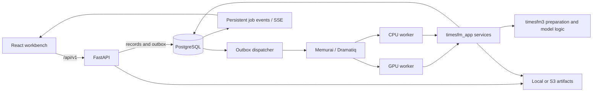

# Workbench architecture and boundaries

The primary product is a local Next.js/React client backed by FastAPI. The
browser owns configuration and presentation; `timesfm_app` owns the HTTP
contract, durable records, artifact access, job dispatch, and process
supervision; `timesfm3` owns data preparation, forecasting, analysis, and
tracking calculations. The legacy Streamlit client is separate
([module map](../docs/codebase/ARCHITECTURE.md#primary-workbench-architecture)).

## Request and result path

The web client calls relative `/api/v1` paths through the Next.js API proxy
([client wrapper](../web/src/lib/api.ts#L1)). The FastAPI app validates local
host and browser-origin boundaries. It has no login: it accepts only configured
localhost origins for mutating browser requests, while native API clients with
no `Origin` remain supported ([API boundary](../src/timesfm_app/api.py#L116)).

Dataset upload validates the incoming table, stores source bytes as an artifact,
and creates an immutable dataset-version record with the content hash and
artifact descriptor. Re-uploading identical bytes to the same dataset returns
the existing version ([upload path](../src/timesfm_app/api.py#L297),
[duplicate identity test](../tests/test_app_api.py#L46)).

Forecast and analysis submission validates the request against workspace-owned
versions and creates a durable idempotent job. The worker calls
`timesfm_app.services.execute_spec`, which prepares inputs and performs
preflight before model resolution, then invokes the `timesfm3` functions. It
writes output artifacts before the current attempt publishes a result record
([submission](../src/timesfm_app/api.py#L204),
[`execute_spec`](../src/timesfm_app/services.py#L417)). The browser follows job
state through persisted events and an SSE endpoint. See [durable jobs](durable-jobs.md)
for retry, lease, and cancellation details.

## Workspace and local trust boundary

Workspace IDs scope records and references; they are not user identities or
security boundaries. The app is unauthenticated and configured for loopback use.
The API checks that dataset versions and parent runs belong to the requested
workspace, but this does not provide multi-user isolation
([workspace validation](../src/timesfm_app/api.py#L201),
[cross-workspace test](../tests/test_app_api.py#L103)). Do not expose the
configured service publicly as if it were an authenticated multi-user app.

The API and workers keep metadata in PostgreSQL and tabular/binary objects in a
separate local or S3 artifact store. The browser never owns inference or a saved
result. For operations and health checks, see [local operations](operations.md);
for data-to-model execution, see [forecasting pipeline](forecasting-pipeline.md).
